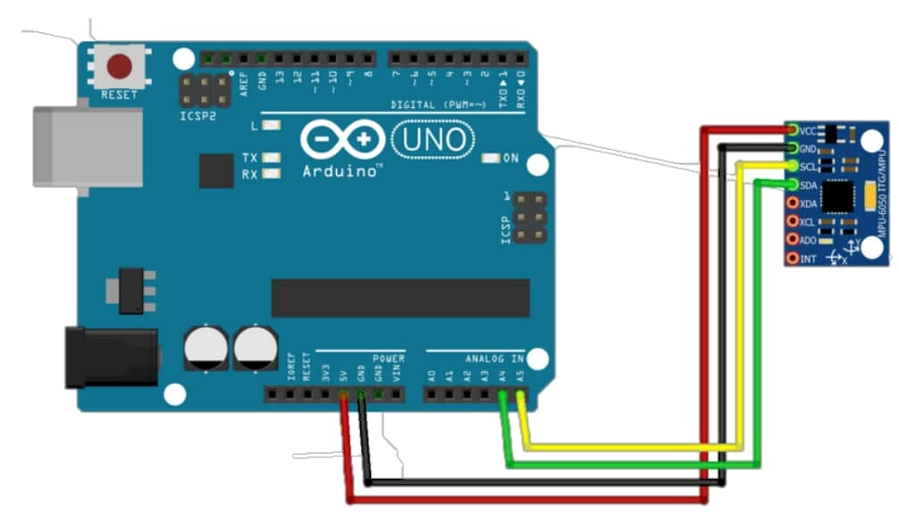

# MiniProject1

A simple mini-project using Arduino and MPU6050 sensor for the Mechatronics course at University of Tehran. 

## Circuit Schematic

the circuit schematic is shown in the following image.



## Usage

1. Upload the `./mpu6050/mpu6050.ino` code to the Arudino.
2. Run the `Q2_1.py` python program. 

The code in the files `Q2_1.py` and `Q2_2.py` are the same. Just in the line 6 and 7, uncomment the the desired method for calculating the rotation angles. For reading roll, pitch yaw use:

```python
# use_from='quaternion'
use_from='roll_pitch_yaw'
```

And for reading quaternions from serial port use:

```python
use_from='quaternion'
# use_from='roll_pitch_yaw'
```


## Sample video


## Acknowledgement

This mini-project is done with the help of [BenMor99](https://github.com/BenMor99).

